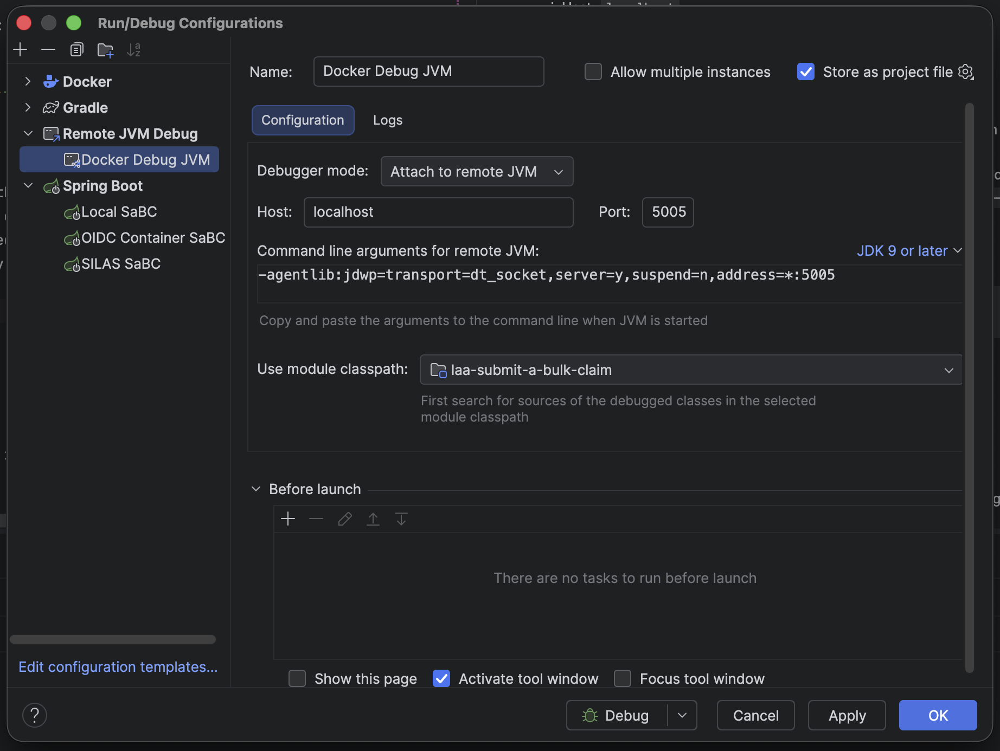
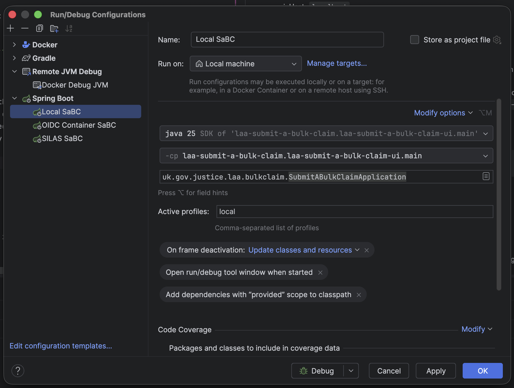

# Submit a Bulk Claim

[](https://github-community.service.justice.gov.uk/repository-standards/laa-submit-a-bulk-claim)

Submit a Bulk Claim is a Spring Boot web application that enables Legal Aid Agency providers to
upload and track claims in bulk.
The service authenticates users via Sign into LAA Services (SILAS), orchestrates validation and
processing through the Data Stewardship `data-claims-api`, and surfaces submission feedback through
a lightweight web UI.

## Table of Contents

- [Commit hooks](#commit-hooks)
- [Overview](#overview)
- [Key Capabilities](#key-capabilities)
- [Integrations](#integrations)
- [Architecture](#architecture)
- [Tech Stack](#tech-stack)
- [Local Development](#local-development)
    - [Prerequisites](#prerequisites)
    - [Set Local Variables](#set-local-variables)
    - [Authentication](#authentication)
        - [SILAS](#silas)
        - [OIDC Mock Server](#oidc-mock-server)
    - [Running the Application](#running-the-application)
    - [Configuration](#configuration)
- [Testing](#testing)
    - [Unit Tests](#unit-tests)
    - [Accessibility Tests](#accessibility-tests)
    - [E2E Tests](#e2e-tests)
- [Deployment](#deployment)
- [Tooling & Conventions](#tooling--conventions)
- [Documentation](#documentation)
- [Project Structure](#project-structure)
- [Logging Configuration](#logging-configuration)
- [Contributing](#contributing)
- [License](#license)

## Commit hooks

Run scripts/setup-hooks.sh to install pre-commit hooks for Git. This will install prek pre commit
hook into git, which helps to:

- Run Spotless to automatically format Java files
- Run Checkstyle validation
- Scan for potential secrets in code

To install prek

```sh
cd scripts
chmod +x ./setup-hooks.sh
./setup-hooks.sh 
```

Note: Setup scripts needs to be run twice
Note: If Spotless detects formatting issues, the commit will fail. After Spotless applies the
formatting, you can commit the changes again.

To run pre-commit hooks manually:

```sh
git add .
prek run --all-files
```

## Overview

- Securely capture, validate, and submit bulk claims for providers authorised via SILAS.
- Surface submission progress, validation results, and historic uploads via search workflows.
- Integrate with downstream services through client libraries generated from the `data-claims-api`.

## Key Capabilities

- Guided bulk file upload with validation, virus scanning, and provider scoping.
- In-progress polling for submission status as the Data Stewardship platform processes files.
- Search and pagination for previous submissions with detailed status and error summaries.
- Role-aware error handling and feedback aligned to GOV.UK design guidance.

## Integrations

- **SILAS (Sign into LAA Services)** – Production authentication relies on Azure AD SILAS tenants.
  Locally, use the [laa-oidc-mock-server](https://github.com/ministryofjustice/laa-oidc-mock-server)
  to emulate SILAS OIDC flows.
- **Data Stewardship `data-claims-api`** – REST client (`DataClaimsRestClient`) fetches submission
  summaries, claim details, and validation messages. Data transfer objects are supplied via the
  shared data stewardship model packages.
- **WireMock stubs** – Local testing depends on WireMock mappings in `wiremock/mappings` to simulate
  Data Stewardship responses and avoid touching live infrastructure.
- **MapStruct mappers** – DTOs are mapped to UI view models via MapStruct components in
  `laa-submit-a-bulk-claim-ui/src/main/java/uk/gov/justice/laa/bulkclaim/mapper`.

## Architecture

- **Presentation layer** – Spring MVC controllers orchestrate upload (`BulkImportController`),
  polling (`BulkImportInProgressController`), search (`SearchController`), and detail pages.
- **Service and helper layer** – Validators, pagination helpers, and OIDC utilities encapsulate
  business rules and session handling.
- **Clients** – Declarative Spring `@HttpExchange` clients wrap the Data Stewardship API with
  non-blocking WebClient calls.
- **View templates** – Thymeleaf templates render forms, dashboards, and error states.
- **Security** – Spring Security OIDC handles SILAS authentication; client credentials access the
  Data Stewardship API.

## Tech Stack

- Java 21, Spring Boot, Spring Security, Spring WebFlux clients
- Thymeleaf, HTMX, and GOV.UK Design System components
- Gradle build tooling
- MapStruct for DTO/view-model mapping
- JUnit 5, MockMvc, and Mockito for automated testing
- Docker & Docker Compose for local dependencies

## Local Development

### Prerequisites

- Java 21 or higher
- Gradle (or use the included Gradle wrapper)
- Docker Desktop for dependency containers
- GitHub Packages credentials configured for the [
  `laa-ccms-spring-boot-gradle-plugin`](https://github.com/ministryofjustice/laa-ccms-spring-boot-common?tab=readme-ov-file#provide-your-repository-credentials)

### Set Local Variables

The easiest method to set the local variables is the ask another developer for a copy of
their `application-local.yaml` file, then you can set the Spring Profile to `local`.

Set the following environment variables, and application.yaml will pick them up:

   ```sh
   export CLAIM_API_URL=http://localhost:8091
   export CLAIMS_API_ACCESS_TOKEN=dummy-token
   export REST_CLIENT_CONNECT_TIMEOUT=5000
   export REST_CLIENT_READ_TIMEOUT=40000
   export UPLOAD_MAX_FILE_SIZE=10MB
   export SERVER_MAX_FILE_SIZE=10MB
   ```

The example access token aligns with the WireMock fixtures; supply a real token when targeting
non-mocked environments. Update `AUTH_*` and `SILAS_*` variables to match either SILAS sandbox
credentials or the mock server claims.

### Running the Application

In all cases of running the application locally:

- The UI is served on `http://localhost:8082`.
- Management endpoints are exposed on `http://localhost:8083`.

#### LAA Data Claims Parent

The easiest way to run all of the applications locally is to run via
the [laa-data-claims-parent](https://github.com/ministryofjustice/laa-data-claims-parent/blob/main/README.md)
repository. This will run all of the services via Docker Compose.

##### Attach to remote JVM running in docker

You can debug the application by attaching to the JVM running in docker. This way you can still hit
breakpoints and debug the application whilst it's running in docker:

1. Go to Run > Edit Configurations
2. Click + (Add New Configuration)
3. Select Remote JVM Debug
4. Enter the following configuration:
    1. Host: `localhost`
    2. Port: `5005`
    3. Use module classpath: Select `laa-submit-a-bulk-claim`
   


#### Running SaBC via IntelliJ

Following the steps of running everything via the parent repository, you can run the SaBC UI via
IntelliJ by stopping the SaBC docker container and running in IntelliJ instead by creating a Spring
Boot Run Configuration. Properties required
for local development can be found by requesting a copy of the `application-local.yaml` file from
another developer.



#### Running SaBc via CLI

```sh
./gradlew clean bootRun
```

- Use `SPRING_PROFILES_ACTIVE=local` if you maintain separate local overrides.

### Authentication

Two solutions exist for logging into the UI. The main method is via SILAS DEV, however you can also
use the OIDC mock server. Both solutions require setting the following variables which can be gained
from another developer:

```yaml
spring:
  security:
  oauth2:
    client:
      registration:
        silas-identity:
          client-id: ${SILAS_CLIENT_ID}
          client-secret: ${SILAS_CLIENT_SECRET}
          authorization-grant-type: authorization_code
          redirect-uri: "{baseUrl}/login/oauth2/code/{registrationId}"
          scope: ${SILAS_SCOPE}
```

#### SILAS

The main authentication method is to use SILAS DEV. To create an account on SILAS,
go to the slack channel `#staff-identity-exteranl-authentication-service`. You can request the
tenant ID and client ID from another developer. Once access has been provided, you should be able
to login to the UI with the newly created account.

#### OIDC Mock Server

Included in docker-compose as `laa-mock-oidc-service`. This is exposed on `http://oidc:9000`
and align issuer/client details with your local Spring profile. This app is a Spring Authentication
Server which is acting as a quick replacement for SILAS. It's mainly used by the E2E tests, but can
be useful to run locally sometimes if you have no access to SILAS.

This is achieved by building the laa-mock-oidc-service by cloning the repo and following it's
project
[README.md](https://github.com/ministryofjustice/laa-oidc-mock-server/blob/main/README.md).

If you wish to use the OIDC mock server, and are running the SaBC UI also within a docker container,
you will need to map the host within `/etc/hosts` via `sudo nano /etc/hosts` to ensure that the
internal and external host names for the OIDC mock server are the same. Just add the following line
to create a host alias:

```text
127.0.0.1 oidc
```

This allows both docker and your local machine to use `http://oidc:9000` as the OIDC issuer, rather
than having a mismatch between the two.

To run the OIDC mock server, run the following command:

```sh
docker-compose up laa-mock-oidc-service
```

Alternatively, you can use the SILAS sandbox. Ask another developer for details on how to
create an account on SILAS for testing. This account can also be used in deployed environments.

### Configuration

- Default configuration lives in `laa-submit-a-bulk-claim-ui/src/main/resources/application.yaml`.
- Override secrets via environment variables or Spring profiles. Kubernetes deployments source them
  from `laa-submit-a-bulk-claim-secrets` (see `.helm/submit-a-bulk-claim/values.yaml`).
- Upload limits can be adjusted with `UPLOAD_MAX_FILE_SIZE` and `SERVER_MAX_FILE_SIZE`.

## Testing

### Unit Tests

```sh
./gradlew test
```

- Controller and service layers are covered with MockMvc and unit tests.
- WireMock supports integration-style tests against Data Stewardship flows.
- Add new tests alongside changes to maintain coverage.

### Accessibility Tests

```sh
./gradlew :laa-submit-a-bulk-claim-ui:accessibilityTest
```

- Accessibility coverage now runs in this repository as a first-class Java Playwright + axe suite.
- Tests live under `laa-submit-a-bulk-claim-ui/src/accessibilityTest`.
- WireMock fixtures for the suite live under
  `laa-submit-a-bulk-claim-ui/src/accessibilityTest/resources/wiremock`.
- JUnit XML and HTML reports are generated under
  `laa-submit-a-bulk-claim-ui/build/test-results/accessibilityTest` and
  `laa-submit-a-bulk-claim-ui/build/reports/tests/accessibilityTest`.
- See `laa-submit-a-bulk-claim-ui/src/accessibilityTest/README.md` for test structure, stub
  patterns, and debugging tips.

### E2E Tests

E2E tests are designed to run in UAT environments. They can be found on GitHub
within
the [bulk-submission-and-fee-scheme-tests](https://github.com/ministryofjustice/bulk-submission-and-fee-scheme-tests-)
repository.

## Deployment

- GitHub Actions pipelines under `.github/workflows` build, scan, and publish Docker images.
    - `build-main.yml` tags merged changes on `main` and publishes artifacts.
    - `deploy-main.yml` produces release images, pushes to ECR, and triggers helm deployments.
- Kubernetes manifests are defined in `.helm/submit-a-bulk-claim/` with environment-specific
  overrides under
  `.helm/submit-a-bulk-claim/values/`.
- Deployments run on the MoJ Cloud Platform with ModSec ingress and pod security settings defined in
  chart values.

## Tooling & Conventions

- Follows MoJ coding standards; repository badge indicates compliance.
- Formatting and linting are inherited from shared Gradle conventions (
  `laa-ccms-spring-boot-gradle-plugin`).
- MapStruct mappers are generated at compile time; rebuild when DTOs change (
  `./gradlew clean assemble`).

## Documentation

- High-level flow diagrams are available in [`docs/flows`](docs/flows):
    - [`bulk-upload-flow.md`](docs/flows/bulk-upload-flow.md)
    - [`search-flow.md`](docs/flows/search-flow.md)
    - [`submission-detail-flow.md`](docs/flows/submission-detail-flow.md)
- Extend this folder with additional operational or support documentation as needed.

## Project Structure

- `laa-submit-a-bulk-claim-ui/src/main/java/uk/gov/justice/laa/bulkclaim/controller` – Web
  controllers for upload, polling, search, and detail views.
- `laa-submit-a-bulk-claim-ui/src/main/java/uk/gov/justice/laa/bulkclaim/service` – Business
  services and helpers.
- `laa-submit-a-bulk-claim-ui/src/main/java/uk/gov/justice/laa/bulkclaim/client` – Web clients for
  Data Stewardship APIs.
- `laa-submit-a-bulk-claim-ui/src/main/java/uk/gov/justice/laa/bulkclaim/mapper` – MapStruct mappers
  translating API responses to view models.
- `laa-submit-a-bulk-claim-ui/src/main/resources/templates` – Thymeleaf views.
- `wiremock/mappings` – Local stubs for dependent APIs.
- `.helm/submit-a-bulk-claim/` – Helm chart used by GitHub Actions deploy workflows.

## Logging Configuration

This application uses ECS (Elastic Common Schema) structured logging for production environments and
console logging for local development.
For local development logging use: ```./gradlew bootRun --args='--spring.profiles.active=local'```
and add the following to your application-local.yaml

```
logging:
    level:
        root: ${ROOT_LOGGING_LEVEL:info}
        org.springframework: ${SPRING_LOGGING_LEVEL:info}
        uk.gov.justice.laa.bulkclaim: ${APP_LOGGING_LEVEL:info}
    pattern:
        console: "%style{%d{yyyy-MM-dd'T'HH:mm:ss.SSSXXX}}{faint} %highlight{%-5level} %style{%pid}{magenta} %style{---}{faint} %style{[%15.15t]}{faint} %style{[%X{traceId},%X{spanId}]}{yellow} %style{%-40.40logger{39}}{cyan} %style{:}{faint} %msg%n"
```

### Structured Logging (Default/Production)

By default, the application outputs logs in ECS JSON format with distributed tracing support:

```
{
    "@timestamp":"2026-04-10T08:55:16.405456044Z",
    "log":
        {
            "level":"INFO",
            "logger":"uk.gov.justice.laa.bulkclaim.controller.BulkImportController"
        },
    "process":
        {
            "pid":1,
            "thread":{"name":"tomcat-handler-28"}
        },
    "service":
        {
            "name":"laa-submit-a-bulk-claim",
            "version":"1.0.156-SNAPSHOT",
            "environment":"default",
            "node":{"name":"bdc4c8732f19"}
        },
    "message":"Claims API Upload response bulk submission UUID: 019d769a-48f0-7edd-ac31-123c23b2651d",
    "spanId":"b627176af184a77a",
    "traceId":"69d8baf2e639b7e6a9c4c9fff1f02bbd",
    "ecs":{"version":"8.11"}
}
```

## Contributing

- Create a feature branch from `main`.
- Write clear commit messages and include tests for new behaviour.
- Ensure `./gradlew test` passes before raising a pull request.
- Follow the MoJ pull request template and tagging policy where applicable.

## License

[MIT](LICENSE)
