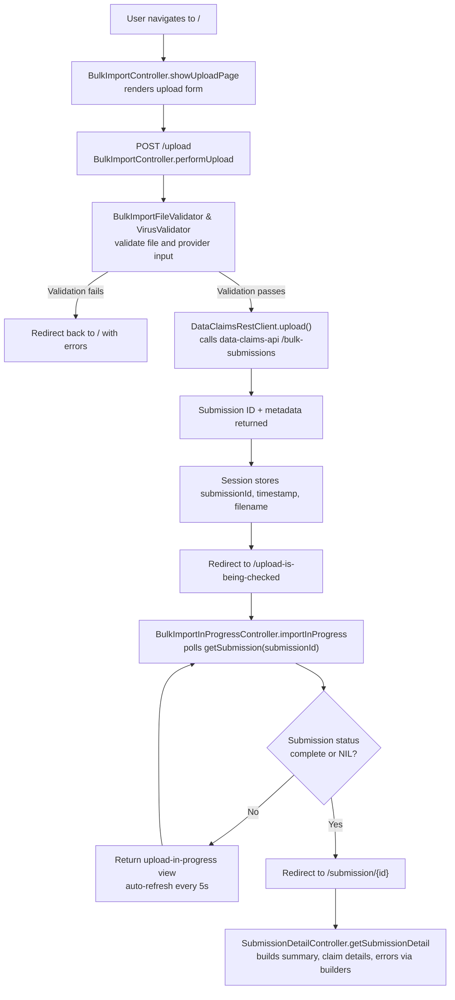

# Bulk Upload Flow

This document summarises the high-level flow when a provider uploads a bulk CWA claim file. It highlights the primary controller, service, and client interactions inside the UI as well as touch points with external systems.

## Flow Overview

## Key Components
- **BulkImportController** – Coordinates upload validation, virus scanning, and the call to `DataClaimsRestClient.upload`.
- **DataClaimsRestClient** – Declarative WebClient interface to the Data Stewardship `data-claims-api`.
- **BulkImportInProgressController** – Polls submission status until validation completes, handling NIL submissions and transient 404s.
- **SubmissionDetailController** – Uses MapStruct-backed builders to compose the UI view models once processing is complete.

## External Dependencies
- **SILAS/OIDC** – The authenticated `OidcUser` supplies the provider identifiers included on upload.
- **Data Stewardship API** – Receives the bulk file, drives validation, and returns submission identifiers and statuses.
- **WireMock** – Provides the above API responses when running locally.
