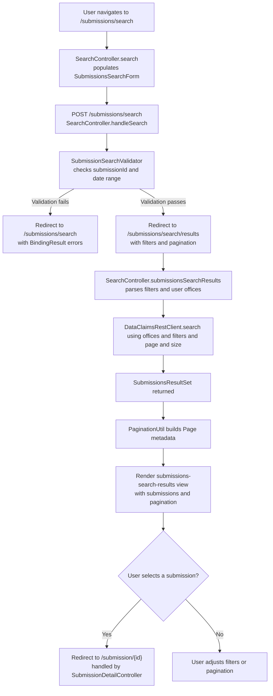

# Search Flow

This document outlines how the search experience retrieves historic submissions, including validation, pagination, and downstream calls to the Data Stewardship platform.

## Flow Overview

## Key Components
- **SearchController** – Owns form lifecycle, validation, and the results page orchestration.
- **SubmissionSearchValidator** – Ensures supplied submission ID format and submitted date range are valid.
- **OidcAttributeUtils** – Extracts SILAS office identifiers from the logged-in `OidcUser` to scope searches.
- **DataClaimsRestClient** – Invokes the `data-claims-api` search endpoint, returning a `SubmissionsResultSet`.
- **PaginationUtil** – Converts API paging metadata into a UI-friendly `Page` object.

## External Dependencies
- **SILAS/OIDC** – Provides the office list that limits the search to the user’s permissible providers.
- **Data Stewardship API** – Supplies submission summaries, statuses, and pagination information.
- **WireMock** – Supplies deterministic search responses during local development.
