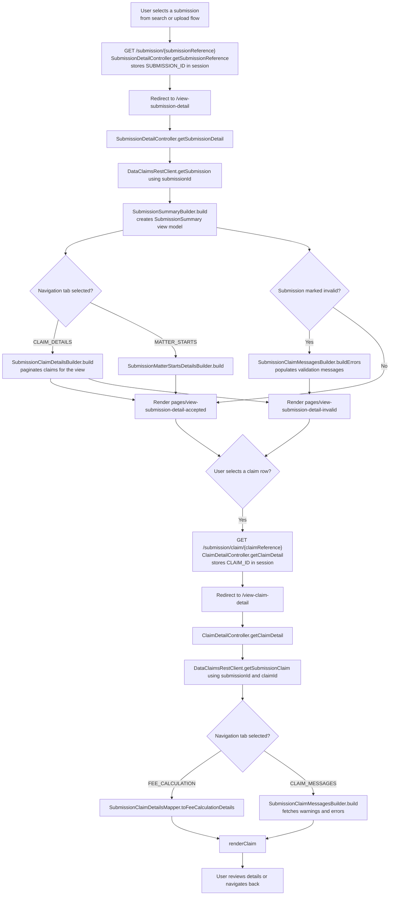

# Submission Detail Flow

This document describes how the application surfaces submission-level and claim-level detail pages after a bulk upload has been processed. It focuses on the controller orchestration, builder/mapper usage, and supporting clients.

## Flow Overview

## Key Components
- **SubmissionDetailController** – Retrieves submission metadata, builds summaries, and routes between claim and matter start tabs.
- **SubmissionSummaryBuilder / SubmissionClaimDetailsBuilder / SubmissionMatterStartsDetailsBuilder** – MapStruct-backed builders that convert API responses into UI-ready models.
- **SubmissionClaimMessagesBuilder** – Fetches and paginates validation errors or warnings for invalid submissions and individual claims.
- **ClaimDetailController** – Loads claim-specific data, supports navigation tabs, and leverages `SubmissionClaimDetailsMapper` for detail and fee calculations.
- **DataClaimsRestClient** – Provides access to submission summaries, claim details, and validation messages from the Data Stewardship `data-claims-api`.
- **Session Attributes** – `SUBMISSION_ID`, `CLAIM_ID`, and related context are preserved across redirects to maintain state.

## External Dependencies
- **Data Stewardship API** – Supplies submission and claim detail payloads, including validation status and matter start data.
- **WireMock (local)** – Mimics the upstream API responses when running on a developer machine.
