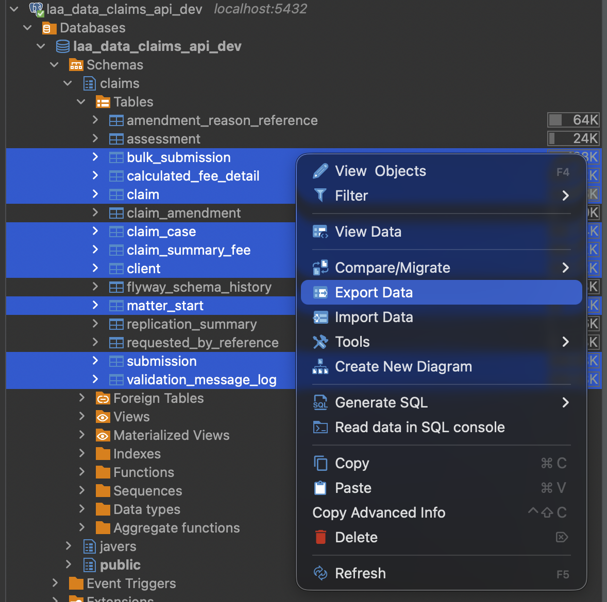

# Submit a Bulk Claim E2E Tests

## Running tests locally

Download the .env file from the team's 1Password vault and place it in the root of the e2e module.
By default this configuration will run the tests against a local instance of the app using silas,
but this can be changed for an app using mock OIDC also.

Ensure that the app is running locally before executing the tests. (see the main
[README](../README.md) for instructions on how to run the app locally)

Run the tests in the command line using the following command:

```bash
./gradlew :e2e:test
```

To run a single test, specify the test class and method name. e.g:

```bash
./gradlew :e2e:test --tests "*BulkSubmissionE2ETest.happyPath"
```

## Generating Allure reports locally

Allure results are collected in the `src/e2e/build/allure-results` directory. To generate a report,
run the following command:

```bash
./gradlew :e2e:allureReport
```

## Seeding DB for E2E tests

As part of the E2E tests, the `JdbcTemplateBaseTest` class is used to seed the database with the
necessary data before executing the tests. This ensures that each test has a consistent and
predictable database state.

To seed data for a test:

1. Make your test class extend `JdbcTemplateBaseTest` instead of `BaseTest`.
2. Implement the `seedDatabase()` method. This is called before every test, after the database has
   been cleared.
3. Inside `seedDatabase()`, use the `Dao` builders (e.g. `BulkSubmissionDao`, `SubmissionDao`,
   `MatterStartDao`, `ValidationMessageLogDao`) to build and insert rows using `jdbcTemplate`, for
   example: `SubmissionDao.builder(bulkSubmissionId).build().insert(jdbcTemplate);`
4. For claims, use the `claimFixtureFactory` helper (`claimFixtureFactory.addClaim(...)`)
   instead of inserting claim rows by hand. It creates a claim along with its related
   `claim_case`, `client`, `claim_summary_fee`, and `calculated_fee_detail` rows in one call.

Data must be inserted in this order, since later tables depend on earlier ones:

1. `claims.bulk_submission`
2. `claims.submission`
3. `claims.claim`
4. `claims.claim_case`
5. `claims.claim_amendment`
6. `claims.client`
7. `claims.claim_summary_fee`
8. `claims.calculated_fee_detail`
9. `claims.assessment`
10. `claims.matter_start`
11. `claims.validation_message_log`

See `SubmissionDetailsE2ETest` for a full example of seeding submissions, claims, matter starts, and
validation messages.

## Generating DBUnit test data for E2E tests
For some E2E tests, the DB is populated directly using DBUnit. This is done by exporting data
from an already populated DB in DBeaver. 

To get data out of DBeaver, right click the tables you
wish to export and click export.



On the resulting pop up, ensure that:
1. On `Export Target` step, the export format is set to `DBUnit`. 
2. On `Format Settings` step, disable `Include NULL values in export`
3. On `Output` step, specify the output directory for the exported data, as a separate file will be created for each table.

Once ready, click `Proceed`.

Finally, condense all of those files manually into a single file, and place it in the `e2e/src/test/resources/datasets` directory.

You should be able to include this dataset in your E2E tests by referencing it
in the test configuration by extending `DbUnitBaseTest` and overriding the `getDataSetPath()` method:
```java
class MyE2ETest extends DbUnitBaseTest {
    @Override
    protected String getDataSetPath() {
        return "datasets/my-dataset.xml";
    }
}
```
